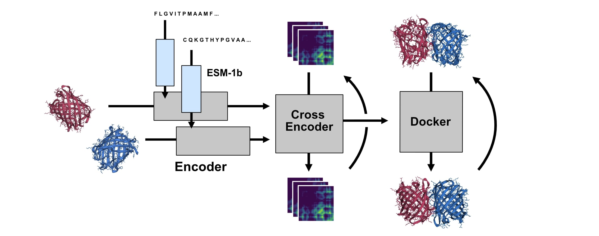

# InterDocker: Iterative Structure-Based Protein Docking

# Architecture

### Dependencies

This repository integrates a number of codebases into a protein-protein docking system.

- [Evolutionary Scale Modeling](https://github.com/facebookresearch/esm)
- [Atom3D](https://github.com/drorlab/atom3d)
- [IPA](https://github.com/lucidrains/invariant-point-attention/)
- [SidechainNet](https://github.com/jonathanking/sidechainnet)
- [Massively Parallel Natural Extension of Reference Frame](https://github.com/EleutherAI/mp_nerf)

IPA and MPNerf are present as submodules, as they are modified from original.

## Data Processing

The file data_preprocess.py will set up data for training. The steps are as follows

- Download LMDBs from Atom3D
- Map LMDBs to separated PDB chains
- Parse PDBs into SidechainNet format, unify data into single files
- Extract and encode sequences from PDB through ESM
- Wrap dataset into single SidechainNet Dataset format

